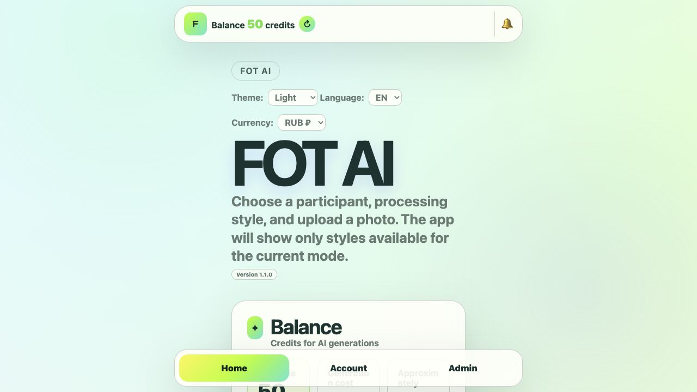
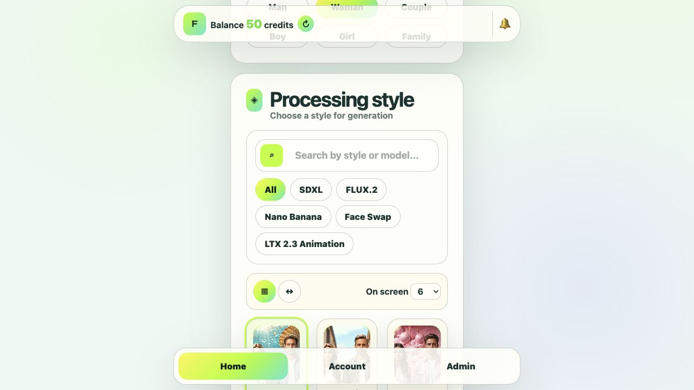
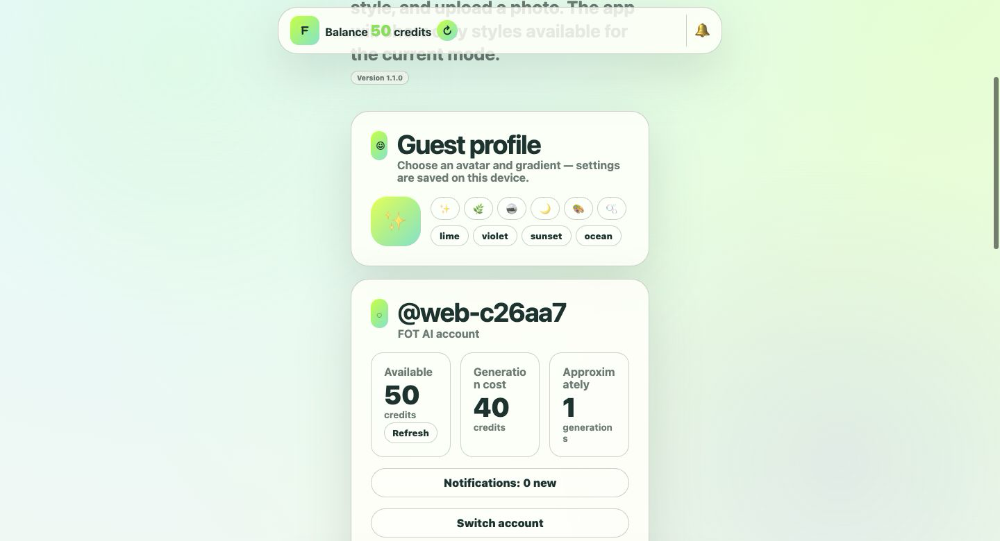
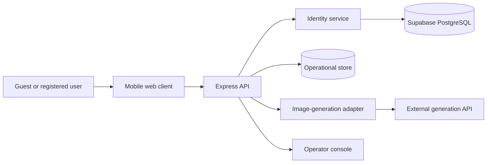

# FOT AI

**A multilingual, mobile-first event photo studio.** Users choose a participant type and visual style, upload a portrait, and receive a generated result through a guided workflow. Personal accounts, credits, history, receipts, feedback, and an operator console turn the concept into a compact product rather than a one-screen demo.

[Live demo](https://fototime-ai-mini-app.onrender.com) · [Product requirements](docs/product-requirements.md) · [User scenarios](docs/user-scenarios.md) · [API reference](docs/api-reference.md) · [QA strategy](docs/qa-strategy.md)


## Why this project exists

FOT AI was created by a QA engineer to improve a real event-photo workflow: reduce the number of manual steps, make style discovery visual, expose clear validation and recovery states, and give the operator enough diagnostic information to support users without inspecting raw server logs.

The project demonstrates product analysis, risk-based testing, frontend and backend development, API design, identity storage, data-retention controls, and release preparation in one small application.

## Product capabilities

- responsive mini-app experience for mobile and desktop;
- Russian, English, and Vietnamese interface languages;
- light, dark, retro, and interactive design themes;
- participant selection and a searchable, filterable style catalog;
- grid and carousel catalog views with configurable page size;
- JPG, PNG, and WebP upload validation up to 10 MB;
- asynchronous image-generation orchestration through a vendor-neutral server adapter;
- result integrity checks before credits are charged;
- guest sessions plus login/password accounts for cross-device recovery;
- Supabase-backed profiles, identities, credentials, and device records;
- personal balance, generation history, receipts, notifications, and feedback;
- operator console for balances, receipts, feedback, audit events, active jobs, and cleanup;
- automatic 14-day retention for generated media and operational records.

## Product tour

| Home and style discovery                            | English interface                                       | Personal account                                          |
| --------------------------------------------------- | ------------------------------------------------------- | --------------------------------------------------------- |
|  |  |  |

The walkthrough is recorded in English and deliberately shows the language selector so the RU / EN / VI experience is visible.

## Architecture at a glance



The public client never receives database secrets or generation credentials. The adapter name and configuration are intentionally generic so the repository documents the application contract rather than a commercial supplier. See [Architecture](docs/architecture.md) for component boundaries and data flows.

## Local setup

Requirements: Node.js 20 or newer.

```bash
git clone https://github.com/natalia-lebedinskaya/fototime-ai-mini-app.git
cd fototime-ai-mini-app
npm install
cp .env.example .env
npm run dev
```

Open `http://localhost:3000`. Without an external image service configured, the application uses the local style fallback and keeps generation disabled with a structured service error. This is intentional: credits must never be charged for a false success.

## Configuration

The repository contains names only; real values belong in the hosting platform or a local `.env` file.

| Area                   | Variables                                                                         |
| ---------------------- | --------------------------------------------------------------------------------- |
| Runtime                | `NODE_ENV`, `HOST`, `PORT`, `CORS_ORIGINS`                                        |
| Image adapter          | `IMAGE_PROVIDER_BASE_URL`, `IMAGE_PROVIDER_API_KEY`, polling and timeout settings |
| Identity database      | `SUPABASE_URL`, `SUPABASE_SECRET_KEY`, `FOTOTIME_SESSION_SECRET`                  |
| Operator access        | `ADMIN_PIN`, `ADMIN_USER_IDS`, `ADMIN_USERNAMES`, `ADMIN_USER_EMAILS`             |
| Optional notifications | `ADMIN_NOTIFICATION_BOT_TOKEN`, `ADMIN_NOTIFICATION_CHAT_ID`                      |

Apply [the Supabase migration](supabase/migrations/20260714_001_identity_profiles.sql) before enabling database-backed identity storage. Full instructions are in [Deployment](docs/deployment.md).

## Quality checks

```bash
npm run verify
```

The verification pipeline checks formatting, parses every production JavaScript entry point, and runs unit plus API tests. The current automated coverage includes provider configuration, catalog envelope normalization, health, structured 404s, operator PIN validation, browser identity, state loading, and the negative generation path.

The repository also includes a risk-based [QA strategy](docs/qa-strategy.md), release gates, exploratory charters, and traceability between requirements and scenarios.

## Documentation map

- [Product requirements](docs/product-requirements.md) — business goals, scope, requirements, acceptance criteria, and success measures.
- [User scenarios](docs/user-scenarios.md) — personas, happy paths, alternatives, and failure recovery.
- [Architecture](docs/architecture.md) — components, database model, security boundaries, generation flow, and retention.
- [API reference](docs/api-reference.md) — current routes, authentication, payloads, responses, and error contract.
- [QA strategy](docs/qa-strategy.md) — risk model, test levels, release gates, and traceability.
- [Data and privacy](docs/data-and-privacy.md) — collected data, purpose, retention, access, and deletion.
- [Deployment](docs/deployment.md) — production configuration and migration steps.

## Status

Version `1.1.0` is a portfolio-ready public release. The image-generation adapter requires server-side configuration; no supplier identity, credentials, user photos, generated results, or local database files are committed.

## License

[MIT](LICENSE) © 2026 Natalia Bedareva
