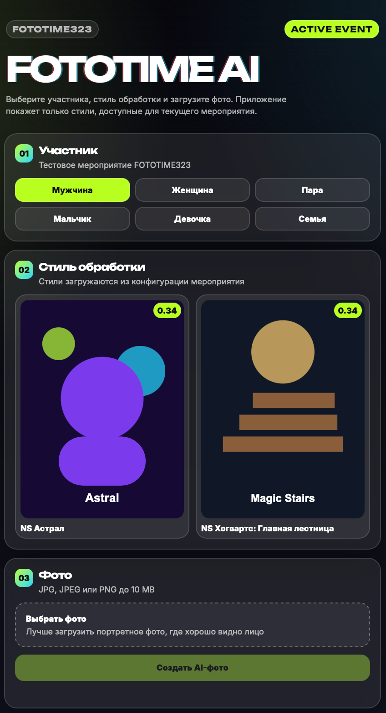

# Fototime AI Telegram Mini App

## Live Demo

Production demo is available here:

https://fototime-ai-mini-app.onrender.com

## Application Preview



## Project Overview

Fototime AI is a Telegram Mini App MVP for AI photo generation based on event configuration.

The application allows a user to:

- open the Mini App from Telegram;
- load an active event configuration;
- select an event participant;
- select an available style;
- upload a photo;
- run mock generation;
- view the generated mock result.

The project is built as a QA-focused pet project with product documentation, test strategy, negative cases and manual checklists.

## Product Logic

The application does not use a hardcoded style list on the frontend.

The expected business flow is:

1. Styles are prepared in an external service.
2. Selected styles are added to an event.
3. A Telegram bot is linked to the event.
4. The Mini App receives the active event configuration.
5. The user selects a participant and sees only styles available for that participant.
6. The user uploads a photo and starts generation.

Current MVP uses mock event data and mock generation result.

## Current Integration Status

The application supports two generation providers:

- `mock` — local mock generation for development and demo fallback;
- `cyberphotobooth` — real external AI generation through CyberPhotoBooth API.

The backend submits a generation request to CyberPhotoBooth, polls generation status and returns the generated image to the frontend.

Sensitive API credentials are stored only in environment variables and are not committed to the repository.

## Tech Stack

- HTML
- CSS
- JavaScript
- Node.js
- Express
- Multer
- Telegram Mini Apps API

## Project Structure

```text
fototime-ai-mini-app/
├── docs/
│   ├── api-contract.md
│   ├── bug-report-examples.md
│   ├── negative-cases.md
│   ├── product-requirements.md
│   ├── release-checklist.md
│   ├── test-cases.md
│   ├── test-strategy.md
│   └── user-flow.md
├── src/
│   ├── client/
│   │   ├── app.js
│   │   ├── index.html
│   │   ├── styles.css
│   │   └── assets/
│   └── server/
│       ├── data/
│       ├── middleware/
│       ├── routes/
│       └── server.js
├── tests/
│   └── manual/
├── .env.example
├── .gitignore
├── CHANGELOG.md
├── package.json
└── README.md
```

## API Endpoints

### `GET /api/health`

Checks backend availability.

### `GET /api/event-config`

Returns mock event configuration:

- event data;
- participants;
- styles;
- style preview URLs;
- participant-to-style relation.

### `POST /api/generate`

Accepts:

- `participantId`;
- `styleId`;
- `photo`.

Returns mock generation result.

## QA Documentation

The repository contains QA artifacts that describe the testing approach:

- `docs/product-requirements.md` — product requirements;
- `docs/user-flow.md` — user flow;
- `docs/test-strategy.md` — test strategy;
- `docs/test-cases.md` — test cases;
- `docs/negative-cases.md` — negative scenarios;
- `docs/api-contract.md` — API contract;
- `docs/bug-report-examples.md` — bug report examples;
- `docs/release-checklist.md` — release checklist;
- `tests/manual/smoke-checklist.md` — smoke checklist;
- `tests/manual/regression-checklist.md` — regression checklist.

## Local Setup

### 1. Install dependencies

```bash
npm install
```

### 2. Create environment file

```bash
cp .env.example .env
```

### 3. Start local server

```bash
npm run dev
```

### 4. Open application

```text
http://localhost:3000
```

Local URL works only after starting the server.

## Manual Smoke Flow

1. Open the application.
2. Check that event configuration is loaded.
3. Select participant.
4. Check that styles are filtered by participant.
5. Select style.
6. Upload valid JPG or PNG image.
7. Start generation.
8. Check loading state.
9. Check success message.
10. Check mock result screen.

## Roadmap

Planned improvements are tracked in GitHub Issues:

- Add Telegram initData validation
- Add external AI service integration
- Add generation timeout and retry states
- Add API test collection
- Improve empty and error states

These tasks describe the next product and QA iterations after the current MVP mock-flow.

## Repository Status

Current version: MVP mock-flow.

The application is suitable for demonstrating:

- product requirements analysis;
- event-based flow modelling;
- API contract understanding;
- frontend/backend interaction;
- negative scenario coverage;
- manual test documentation;
- structured QA approach to a small product.

## Style Mapping

Frontend style cards are mapped to CyberPhotoBooth style identifiers on the backend.
API keys and provider configuration are stored only in environment variables.

Current mappings:

- `ns-spring-city` → `1093`
- `ns-dryad-01` → `1252`
- `ns-astral` → `1259`
- `ns-hogwarts-stairs` → `1027`
- `ns-valentine-01` → `Kaftan` fallback
