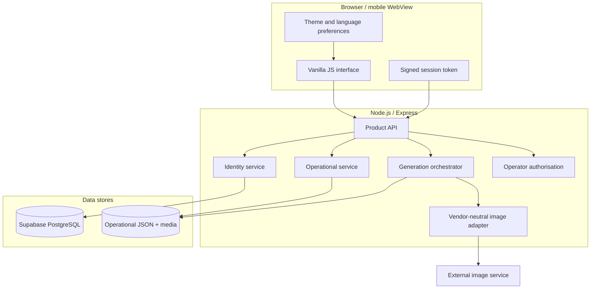

# Architecture

## Context

FOT AI is a compact mobile web application with a vanilla JavaScript client and an Express backend. The backend owns identity verification, catalog access, generation orchestration, credit rules, media storage, retention, and operator authorisation.



## Component responsibilities

### Client

- renders the three-step workflow and account/operator surfaces;
- keeps only a signed session token in session storage;
- stores non-sensitive language, theme, layout, and device preferences locally;
- validates basic file constraints before upload;
- never calls the image service or database directly.

### Express application

- applies CORS, request limits, and safe response headers;
- exposes health, version, operator PIN, and product APIs;
- serves the static client and assets;
- returns structured errors for API requests.

### Identity service

- supports browser, password, and verified Telegram identity types;
- hashes passwords with `scrypt` and a unique random salt;
- signs sessions with HMAC-SHA256 and a 14-day expiry;
- uses Supabase in production and a local file store for development;
- returns a public profile projection without credentials.

### Operational service

- maintains balance, history, feedback, notifications, receipts, audit sessions, and active jobs;
- scopes personal data to the resolved signed identity;
- enforces 14-day retention for media and operational records;
- provides operator queries and bulk cleanup.

### Image adapter

- loads the public style catalog with a five-minute cache;
- resolves a local selection to an external style and mode;
- submits the request and polls a job endpoint;
- applies request timeouts and attempt limits;
- returns a normalized result independent of supplier naming.

## Generation sequence

```mermaid
sequenceDiagram
    actor User
    participant UI as Mini-app
    participant API as Product API
    participant Store as Operational store
    participant Adapter as Image adapter
    participant Service as External service

    User->>UI: Select participant, style, and photo
    UI->>API: POST /api/fototime/generate
    API->>API: Resolve session and validate input/balance
    API->>Store: Record active job and audit event
    API->>Adapter: Generate image
    Adapter->>Service: Submit job
    loop Until terminal status
      Adapter->>Service: Poll job status
    end
    Adapter-->>API: Result URL or base64 image
    API->>API: Download and validate result integrity
    alt Valid result
      API->>Store: Save media, debit credits, record history
      API-->>UI: Result, balance, metadata
    else Failure or invalid result
      API->>Store: Remove temporary media and record failure
      API-->>UI: Structured error; balance unchanged
    end
```

## Database model

The migration creates four protected tables:

```mermaid
erDiagram
    FOT_PROFILES ||--o{ FOT_IDENTITIES : owns
    FOT_PROFILES ||--o| FOT_CREDENTIALS : has
    FOT_PROFILES ||--o{ FOT_DEVICES : uses

    FOT_PROFILES {
      text id PK
      text username
      text display_name
      jsonb preferences
      text status
      timestamptz last_seen_at
    }
    FOT_IDENTITIES {
      uuid id PK
      text profile_id FK
      text provider
      text provider_subject
      jsonb metadata
    }
    FOT_CREDENTIALS {
      text profile_id PK_FK
      text password_hash
    }
    FOT_DEVICES {
      uuid id PK
      text profile_id FK
      text provider
      text device_name
      text user_agent
    }
```

Row-level security is enabled. Anonymous and authenticated browser roles have no table permissions; only the server-side service role can read or write identity data.

Operational balance, history, feedback, notifications, receipts, and audit records currently use a server-side JSON/media store. This keeps the self-hosted demo simple but requires persistent disk in production. Moving operational records to PostgreSQL is the next scalability step; the identity database is already separated to make that migration incremental.

## Security boundaries

- `SUPABASE_SECRET_KEY`, session secret, image-service key, operator PIN, and notification token are server-only.
- The client submits `X-FOT-Session`; the backend replaces any client-supplied user identifiers with the resolved session profile.
- Operator access has no default credentials and uses constant-time PIN comparison plus attempt throttling.
- Media is served through scoped file endpoints with basename normalization.
- Upload limits are enforced by Multer before business processing.
- Generated media is charged only after hash and marker validation.

## Reliability decisions

- Catalog failure falls back to a small local list so the UI remains testable.
- Generation failure is fail-closed: no false success and no credit debit.
- Active jobs are recorded before the external request and removed on terminal success/failure.
- Result downloads have a separate timeout.
- Cleanup removes metadata and associated files together.

## Repository boundaries

Tracked: source code, migration, tests, documentation, and verified media used by the README.

Ignored: `.env`, databases, runtime JSON, user uploads, generated results, receipts, logs, coverage, dependencies, and rescue files.
